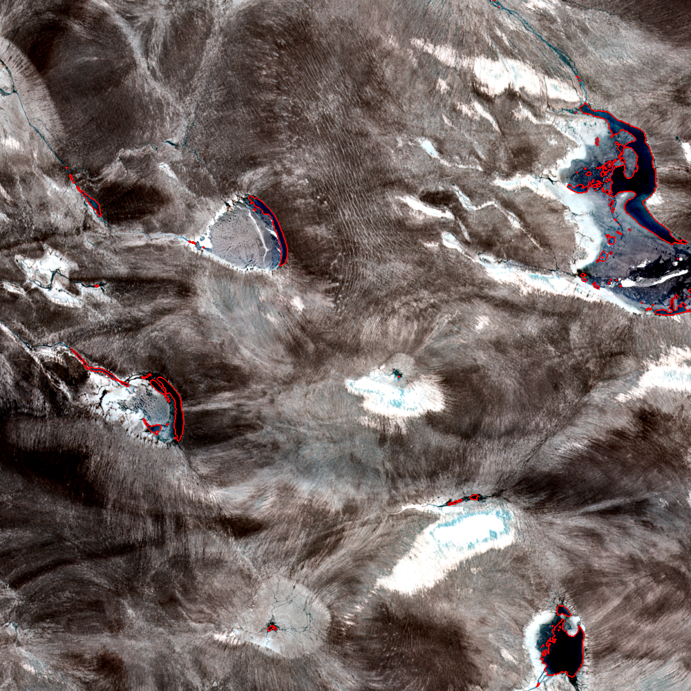

# Counting Greenland melt ponds with off-the-shelf bioimage tools

**A cross-discipline OSCARS–FIESTA example.** This repository takes the *standard*
Galaxy bioimage-analysis workflow — the exact "threshold → label → count →
measure" chain that the
[GTN imaging intro tutorial](https://training.galaxyproject.org/training-material/topics/imaging/tutorials/imaging-introduction/tutorial.html)
uses to count stained cell nuclei — and, **without modifying or adding a single
tool**, applies it to a Sentinel-2 satellite image to map and count
**supraglacial melt ponds** on the Greenland ice sheet.

> The point: a segmentation-and-counting pipeline is generic raster maths. The
> [`imgteam`](https://github.com/BMCV/galaxy-image-analysis) tools a biologist
> runs on a microscope image run unchanged on a glacier. The only
> discipline-specific choice is *which quantity we threshold* — a stain intensity
> for cells, a water index for melt ponds.



## Why melt ponds

Supraglacial melt ponds and lakes are a climate-relevant signal: they darken the
ice (lowering albedo), store and route meltwater, and can drain catastrophically
to the bed. Mapping and counting them across a melt season is exactly an
object-detection-and-measurement task — the same one bioimaging solved years ago.

## The workflow

| # | Step | Galaxy tool (`imgteam`) | Purpose |
|---|------|------------------------|---------|
| 1 | Water index | `image_math` | NDWIᵢ𝒸 = (B02 − B04)/(B02 + B04) |
| 2 | Denoise | `2d_simple_filter` (median 3×3) | remove single-pixel speckle |
| 3 | Threshold | `2d_auto_threshold` (manual 0.25) | water mask |
| 4 | Label | `binary2labelimage` (cca) | one object per pond |
| 5 | Count | `count_objects` | number of ponds |
| 6 | Measure | `2d_feature_extraction` | area + mean index per pond |
| 7 | Overlay | `overlay_images` (seg_contour) | outlines on true colour |

All tools are deployed on [usegalaxy.eu](https://usegalaxy.eu); the workflow is
in [`workflows/`](workflows/) and a step-by-step guide is in
[`tutorial/tutorial.md`](tutorial/tutorial.md).

## Result

On the 10 km × 10 km demo chip, the workflow detects **90 melt ponds and lakes**
covering **1.46 km²** of melt water (the largest lake is **0.64 km²**; 57 ponds
are larger than 500 m²; median pond ≈ 900 m²). NDWIᵢ𝒸 > 0.25 is the established
threshold of Williamson et al. (2018); switching to automatic Otsu thresholding
(≈ 0.32 here) is a one-click sensitivity check.

- **Reproducible Galaxy history (public, runs as-is):**
  <https://usegalaxy.eu/u/annefou/h/11ac94870d0bb33aee961e7883fc2313>
- **Importable workflow:** [`workflows/meltpond_mapping_sentinel2.ga`](workflows/meltpond_mapping_sentinel2.ga)
- **Per-pond measurements:** [`results/pond_features.tabular`](results/pond_features.tabular)

## Reproduce it

**Option A — run in Galaxy (no install).** Import the workflow from
[`workflows/`](workflows/) into [usegalaxy.eu](https://usegalaxy.eu), upload the
three files in [`data/`](data/), and run. See the
[tutorial](tutorial/tutorial.md).

**Option B — regenerate the input chip from source.** The two Sentinel-2 bands are
clipped directly from the free AWS Open Data archive (no login) by:

```bash
pip install rasterio numpy imageio
python scripts/make_chip.py data/
```

## Data

A 10 km × 10 km clip of the public scene `S2A_22WEV_20190723_0_L2A` (tile T22WEV,
2019-07-23, 2.6 % cloud) over the SW Greenland melt zone. 10 m pixels → 100 m²
each. Full provenance and licence: [`data/provenance.md`](data/provenance.md).
Independent lake outlines for validation: Glen et al. (2025),
[Zenodo 10.5281/zenodo.11645884](https://doi.org/10.5281/zenodo.11645884).

## How this fits the FIESTA cross-discipline family

Part of a set of OSCARS–FIESTA demonstrations that move a method across
disciplines using Galaxy:

- [`fiesta-galaxy-cellprofiler-eo`](https://github.com/annefou/fiesta-galaxy-cellprofiler-eo) — bioimaging object tracking → drifting icebergs
- [`fiesta-galaxy-sourceextractor-eo`](https://github.com/annefou/fiesta-galaxy-sourceextractor-eo) — astronomy source extraction → settlement lights
- [`fiesta-galaxy-bioimageio-eo`](https://github.com/annefou/fiesta-galaxy-bioimageio-eo) — BioImage.IO nucleus model → water bodies
- **this repo** — generic bioimage segmentation/counting → supraglacial melt ponds

Unlike the others, this one uses only the **plain, deployed `imgteam` tools** (no
deep-learning model, no custom wrapper) — the lowest-friction cross-discipline
reuse possible: same tools, new science.

## References

- Williamson, A. G. et al. (2018). *Dual-satellite (Sentinel-2 and Landsat 8)
  remote sensing of supraglacial lakes in Greenland.* The Cryosphere 12, 3045–3065.
  <https://doi.org/10.5194/tc-12-3045-2018>
- Glen, K. et al. (2025). *Mapping supraglacial meltwater …, SW Greenland.* The
  Cryosphere 19, 1047. <https://doi.org/10.5194/tc-19-1047-2025>
- BMCV Galaxy Image Analysis tools. <https://github.com/BMCV/galaxy-image-analysis>

## Licence

Code and documentation: see [`LICENSE`](LICENSE). Input imagery: contains modified
Copernicus Sentinel data 2019 (free and open).
